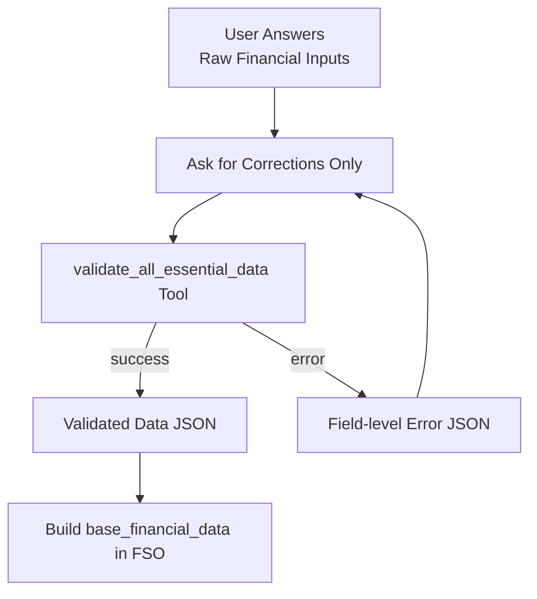

# Validation & Normalization Tool – README

## Overview

This module provides a **single, comprehensive validation tool** plus supporting
helpers used by the `financial_data_collector_agent` to turn raw, user-entered
strings into a **clean, normalized data object** that can be safely stored in
the Financial State Object (FSO).

The main entrypoint is:

```python
validate_all_essential_data(...)
```

It is designed to be:

- **Deterministic** – no randomness, no LLM calls.
- **Strict but friendly** – rejects invalid values with clear reasons.
- **FSO-ready** – outputs a compact JSON that the agent can directly embed
  into `financial_state_object["base_financial_data"]`.

---

## Responsibilities

1. Parse and validate **numeric fields**:

   - `monthly_net_income_str`
   - `monthly_commitments_str`
   - `monthly_emi_str`
   - `investment_contributions_str`
   - `savings_per_month_str`
   - `emergency_fund_amount_str`

2. Parse **Yes/No-style flags**:

   - `has_life_insurance_str`
   - `has_health_insurance_str`

3. Provide:
   - A normalized object on success
   - A structured error JSON on failure

---

## Helper Functions

### `_sanitize_and_parse_number_str(s: str)`

Parses loosely formatted numeric strings into floats.

Supports:

- Commas: `"1,20,000"`
- Currency: `"₹5,000"`, `"$12,000.50"`
- Suffixes: `"5k" -> 5000.0`, `"1.2M" -> 1200000.0"`

Returns:

```python
(ok: bool, value: Optional[float], err_msg: str)
```

---

### `_parse_multi_item_list(input_str: str, non_negative_check: bool = True)`

Parses multi-item financial lists for:

- Monthly commitments
- EMIs per debt type
- Investment contributions

Accepted formats:

- JSON:

  ```json
  { "rent": 15000, "groceries": 8000 }
  ```

- Key-value list:
  `rent:15000, groceries:8000`

- Plain amounts:
  `15000, 8000, 2000`

Returns:

```python
(ok: bool, items: List[Dict[str, float]], total: float, err_msg: str)
```

Where each item is:

```json
{ "type": "rent", "amount": 15000.0 }
```

---

### `_parse_yes_no_flag(s: str, field_label: str)`

Converts Yes/No-style strings into booleans.

Accepted values (case-insensitive):

- True: `"yes"`, `"y"`, `"true"`, `"1"`
- False: `"no"`, `"n"`, `"false"`, `"0"`

Returns:

```python
(ok: bool, value: Optional[bool], err_msg: str)
```

---

## Main Tool: `validate_all_essential_data(...)`

### Signature

```python
validate_all_essential_data(
    monthly_net_income_str: str,
    monthly_commitments_str: str,
    monthly_emi_str: str,
    investment_contributions_str: str,
    savings_per_month_str: str,
    emergency_fund_amount_str: str,
    has_life_insurance_str: str,
    has_health_insurance_str: str,
) -> Dict[str, str]
```

### Inputs

All parameters are **raw strings**, typically captured from LLM conversation.

- `monthly_net_income_str`
- `monthly_commitments_str`
- `monthly_emi_str`
- `investment_contributions_str`
- `savings_per_month_str`
- `emergency_fund_amount_str`
- `has_life_insurance_str` (Yes/No-like)
- `has_health_insurance_str` (Yes/No-like)

### Success Output

```json
{
  "status": "success",
  "data": "{...JSON...}"
}
```

Where `data` (decoded) looks like:

```json
{
  "monthly_net_income": 120000.0,
  "commitments": [{ "type": "rent", "amount": 15000.0 }],
  "total_commitments": 15000.0,
  "emis": [{ "type": "home_loan", "amount": 25000.0 }],
  "total_emi": 25000.0,
  "investments": [{ "type": "sip_equity", "amount": 10000.0 }],
  "total_investment_contributions": 10000.0,
  "savings_per_month": 5000.0,
  "emergency_fund_amount": 100000.0,
  "has_life_insurance": true,
  "has_health_insurance": false
}
```

### Error Output

```json
{
  "status": "error",
  "error_message": "{...JSON...}"
}
```

Where `error_message` is itself a JSON string mapping field names to errors, e.g.:

```json
{
  "monthly_net_income": "Monthly net income must be greater than 0.",
  "has_life_insurance": "'has_life_insurance' must be Yes/No ..."
}
```

The agent can parse this and ask ONLY for the problematic fields again.

---

## Integration with `financial_data_collector_agent`



- The agent:
  - Collects user inputs as strings
  - Calls `validate_all_essential_data`
  - On success → embeds parsed data into FSO
  - On error → asks user only for the fields that failed

---

## Design Goals

- **KISS & SOLID**: One focused module, one main tool.
- **Reusable** across agents that need consistent numeric & flag validation.
- **Safe for production**: strict validation and explicit error messages.

---
